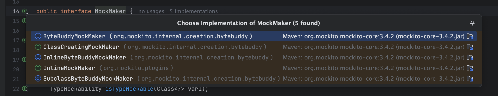
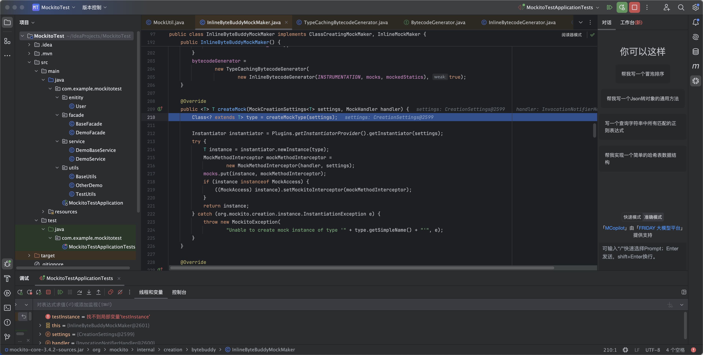
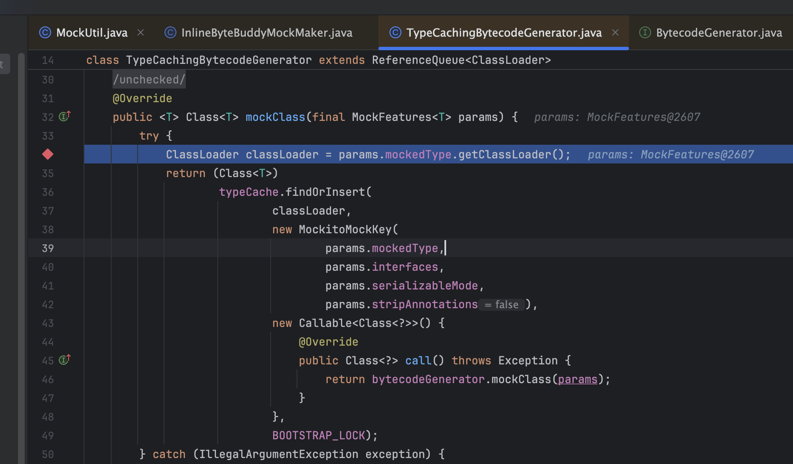
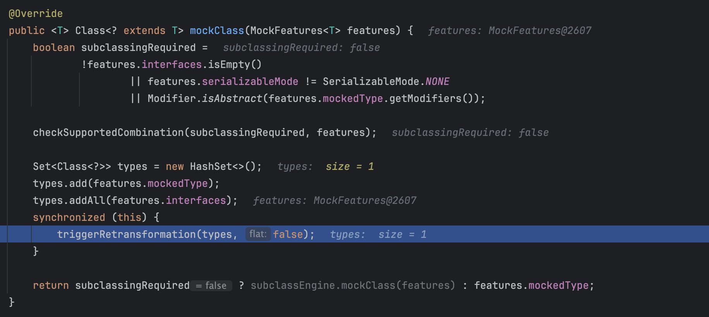
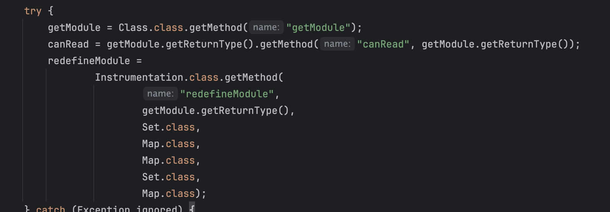
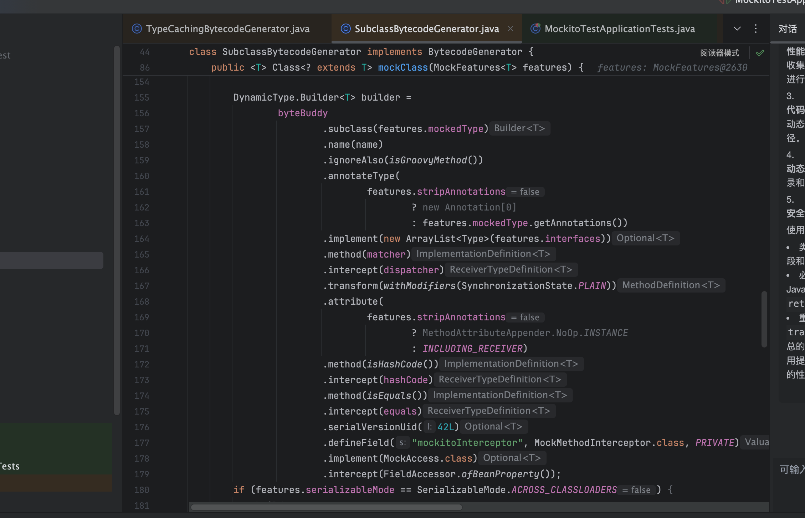
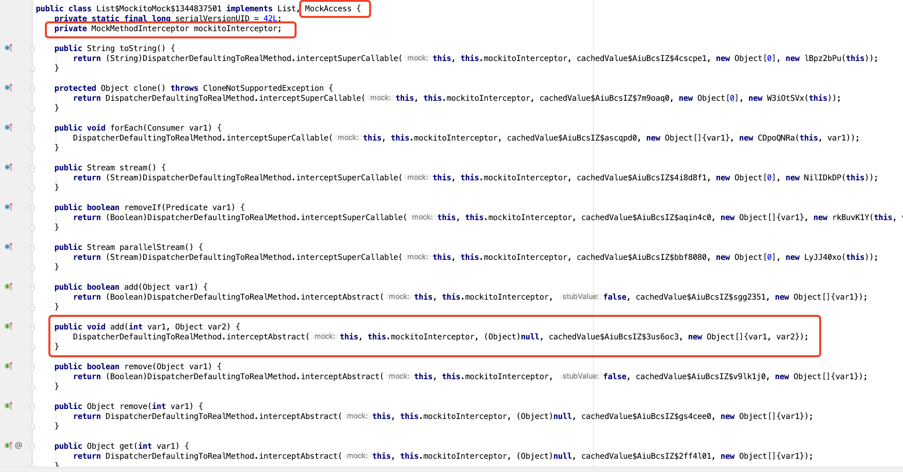
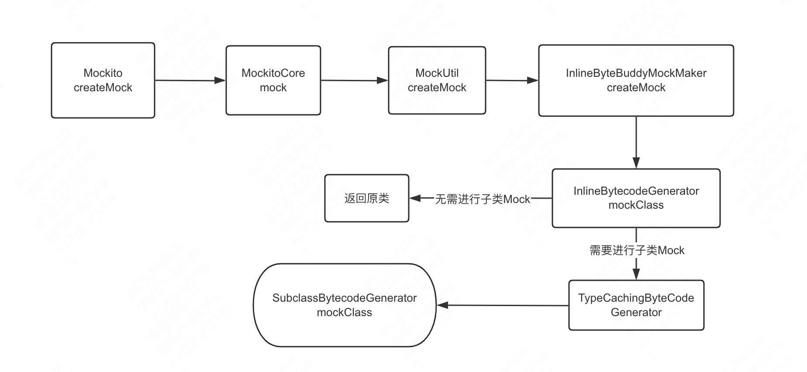

# Mockito源码解读（二）

## 前言

这篇文章五一放完假后就开始起笔了，但由于工作要写需求和学校一些作业以及核心代码读起来很费劲一直拖到现在才写完。感觉写得也挺潦草，在解读mock的核心代码时遇到的许多特性都是之前没接触过的，比如byteBuddy框架和一些JavaAgent的机制，后续也得系统学一下字节码相关的知识。

在读的过程中确实觉得函数编写的比较复杂，难读懂。代码中间夹杂着一些与核心流程无关的优化代码，要对代码进行筛查，同时在读的过程中疯狂参考网上的博客和问GPT，才让我对它的原理和技术实现的细节有了一个大概的了解。果然源码解读不是一个容易事，我还是比较喜欢看黑马程序员那种别人把东西喂到嘴里的视频课😄。

转眼已经实习了两个月半了 ，在实习的期间还是学到了不少东西的。写的代码第一次上线的时候还挺紧张，代码重构的时候改一点，commit一次，然后发现还有一些地方不对，又改又重新commit，最后验了几轮才上线，所幸没出什么bug，感谢mentor的不懈指导 🙏

## FieldSetter

回顾上一章的结尾。在process 函数为一个字段的注解创建好mock对象后会调用会调用FieldSetter的setField函数

```java
for(int var12 = 0; var12 < var11; ++var12) {
    Annotation annotation = var10[var12];
    Object mock = this.createMockFor(annotation, field);
    if (mock instanceof MockedStatic) {
        mockedStatics.add((MockedStatic)mock);
    }

    if (mock != null) {
        this.throwIfAlreadyAssigned(field, alreadyAssigned);
        alreadyAssigned = true;

        try {
            FieldSetter.setField(testInstance, field, mock);
        } catch (Exception var18) {
            Exception e = var18;
            Iterator var16 = mockedStatics.iterator();

            while(var16.hasNext()) {
                MockedStatic<?> mockedStatic = (MockedStatic)var16.next();
                mockedStatic.close();
            }

            throw new MockitoException("Problems setting field " + field.getName() + " annotated with " + annotation, e);
        }
    }
}
```

那么setField 函数中到底执行了什么内容呢，让我们步入它的源码。

```java
public static void setField(Object target, Field field, Object value) {
    AccessibilityChanger changer = new AccessibilityChanger();
    changer.enableAccess(field);

    try {
        field.set(target, value);
    } catch (IllegalAccessException var5) {
        IllegalAccessException e = var5;
        throw new RuntimeException("Access not authorized on field '" + field + "' of object '" + target + "' with value: '" + value + "'", e);
    } catch (IllegalArgumentException var6) {
        IllegalArgumentException e = var6;
        throw new RuntimeException("Wrong argument on field '" + field + "' of object '" + target + "' with value: '" + value + "', \nreason : " + e.getMessage(), e);
    }

    changer.safelyDisableAccess(field);
}
```

可以看到，在函数中首先使用AccessibilityChanger修改了field字段的访问权限，保证该字段可达。

然后在调用field.set()函数，将target中的field字段设置为value值。set函数的底层逻辑如下

```java
@CallerSensitive
@ForceInline // to ensure Reflection.getCallerClass optimization
public void set(Object obj, Object value)
    throws IllegalArgumentException, IllegalAccessException
{
    if (!override) {
        Class<?> caller = Reflection.getCallerClass();
        checkAccess(caller, obj);
    }
    getFieldAccessor(obj).set(obj, value);
}
```

这个函数为Field字段的基本函数，其作用可以通过源码上的注释得知

> Sets the field represented by this Field object on the specified object argument to the specified new value. The new value is automatically unwrapped if the underlying field has a primitive type.

意思是将object中的该字段对象中的值更换为一个新的值。

那么这个函数在这里的作用久很明显了，那就是将**遍历到的测试类中被Mock注解修饰的对象调包成上文通过createMockFor函数创建的对象**

在调包后，setField函数又通过changer.safelyDisableAccess将字段的访问权限改了回来。


接下来，我们深入annotationProcessorMap中，查看各自注解对应的处理器是怎么工作的。

## AnnotationProcessorMap

在IndependentAnnotationEngine类的构造函数中对annotationProcessorMap进行了初始化

```java
public IndependentAnnotationEngine() {
    this.registerAnnotationProcessor(Mock.class, new MockAnnotationProcessor());
    this.registerAnnotationProcessor(Captor.class, new CaptorAnnotationProcessor());
}
```

可以看到，在该Map中主要包含了两个注解处理器：一个是Mock注解的处理器，另一个是Captor注解的处理器。

在createMockFor 函数中，方法通过调用processor的process函数对字段和注解进行处理，因此我们可以将其当作入口

### MockAnnotationProcessor

从名字可以看出，MockAnnotationProcessor为对@Mock注解进行处理的处理器，其内容如下：

```java
public Object process(Mock annotation, Field field) {
    Class var10001 = field.getType();
    Objects.requireNonNull(field);
    return processAnnotationForMock(annotation, var10001, field::getGenericType, field.getName());
}
```

可以看到，它通过field字段拿到它的类型，然后调用了processAnnotationForMock函数对其进行进一步的处理


```java
public static Object processAnnotationForMock(Mock annotation, Class<?> type, Supplier<Type> genericType, String name) {
    MockSettings mockSettings = Mockito.withSettings();
    if (annotation.extraInterfaces().length > 0) {
        mockSettings.extraInterfaces(annotation.extraInterfaces());
    }

    if ("".equals(annotation.name())) {
        mockSettings.name(name);
    } else {
        mockSettings.name(annotation.name());
    }

    if (annotation.serializable()) {
        mockSettings.serializable();
    }

    if (annotation.stubOnly()) {
        mockSettings.stubOnly();
    }

    if (annotation.lenient()) {
        mockSettings.lenient();
    }

    mockSettings.defaultAnswer(annotation.answer());
    return type == MockedStatic.class ? Mockito.mockStatic(inferStaticMock((Type)genericType.get(), name), mockSettings) : Mockito.mock(type, mockSettings);
}
```

可以看到，该函数先将Mock注解中的一些属性迁移到了MockSetting 中，然后根据Mock字段的类型判断是否为MockedStatic,若为MockedStatic，则调用Mockito的mockStatic方法，若不是StaticMock则调用Mockito的mock方法。

CaptorAnnotationProcessor由于之前没咋用过Captor因此暂时先不读了

## Mockito

### initMock

从入口到这之前都是对注解进行处理的过程，到这才终于进入了核心的功能模块，在Mockito中对initMock函数的定义如下

```Java
@CheckReturnValue
public static <T> T mock(Class<T> classToMock, MockSettings mockSettings) {
    return MOCKITO_CORE.mock(classToMock, mockSettings);
}
```

可以看到，它调用了MOCKITO_CORE中的mock方法，而MOCKITO_CORE是由MockitoCore类定义的对象，mockito常用的方法都定义在其中。

先来看其对mock方法的定义

```java
public <T> T mock(Class<T> typeToMock, MockSettings settings) {
    if (!MockSettingsImpl.class.isInstance(settings)) {
        throw new IllegalArgumentException("Unexpected implementation of '" + settings.getClass().getCanonicalName() + "'\nAt the moment, you cannot provide your own implementations of that class.");
    } else {
        MockSettingsImpl impl = (MockSettingsImpl)MockSettingsImpl.class.cast(settings);
        MockCreationSettings<T> creationSettings = impl.build(typeToMock);
        T mock = MockUtil.createMock(creationSettings);
        ThreadSafeMockingProgress.mockingProgress().mockingStarted(mock, creationSettings);
        return mock;
    }
}
```

可以看见，在该函数中也是首先对一些配置信息进行填充，因此我们关注的是其中调用的MockUtil的createMock方法。

在MockUtil中对createMock函数的定义如下

```java
public static <T> T createMock(MockCreationSettings<T> settings) {
    MockHandler mockHandler = MockHandlerFactory.createMockHandler(settings);
    T mock = mockMaker.createMock(settings, mockHandler);
    Object spiedInstance = settings.getSpiedInstance();
    if (spiedInstance != null) {
        (new LenientCopyTool()).copyToMock(spiedInstance, mock);
    }

    return mock;
}
```

可以看到，其通过工厂创建了一个MockHandler对象 

MockHandler 是一个接口 此处调用createMockHandler返回的是它的一个实现类InvocationNotifierHandler 其中主要起作用的为MockHandlerImpl类，其中的内容我们后续再讨论

MockMaker为一个接口,有如下的实现类



在调试过程中我们会发现它步入的实现类为InlineByteBuddyMockMaker



可以看到，该函数通过调用createType函数创建了一个Class对象，且该对象是mock类的子类

该函数调用到TypeCachingByteCodeGenerator类中的mockClass方法



可以看到这个方法执行了一个缓存的操作，最后通过bytecodeGenerator的mockClass接着进行类的构建

接着走调试会发现方法步入到了InlineBytecodeGenerator类中，



在这个函数中可以看到先对参数进行了一些校验，然后调用triggerRetransformation方法对features中的mockedType类和它的接口接你下处理

```java
private <T> void triggerRetransformation(Set<Class<?>> types, boolean flat) {
    Set<Class<?>> targets = new HashSet<Class<?>>();

    for (Class<?> type : types) {
        if (flat) {
            if (!mocked.contains(type) && flatMocked.add(type)) {
                targets.add(type);
            }
        } else {
            do {
                if (mocked.add(type)) {
                    if (!flatMocked.remove(type)) {
                        targets.add(type);
                    }
                    addInterfaces(targets, type.getInterfaces());
                }
                type = type.getSuperclass();
            } while (type != null);
        }
    }

    if (!targets.isEmpty()) {
        try {
            assureCanReadMockito(targets);
            instrumentation.retransformClasses(targets.toArray(new Class<?>[targets.size()]));
            Throwable throwable = lastException;
            if (throwable != null) {
                throw new ...
            }
        } catch (Exception exception) {
            for (Class<?> failed : targets) {
                mocked.remove(failed);
                flatMocked.remove(failed);
            }
            throw new MockitoException("Could not modify all classes " + targets, exception);
        } finally {
            lastException = null;
        }
    }
}
```

这个函数大概干的事情就是递归类的父类，将这些类的接口一起加入到targets集合中，再调用assureCanReadMockito类对这些类进行进一步处理


```java
private void assureCanReadMockito(Set<Class<?>> types) {
    if (redefineModule == null) {
        return;
    }
    Set<Object> modules = new HashSet<Object>();
    try {
        Object target =
                getModule.invoke(
                        Class.forName(
                                "org.mockito.internal.creation.bytebuddy.inject.MockMethodDispatcher",
                                false,
                                null));
        for (Class<?> type : types) {
            Object module = getModule.invoke(type);
            if (!modules.contains(module) && !(Boolean) canRead.invoke(module, target)) {
                modules.add(module);
            }
        }
        for (Object module : modules) {
            redefineModule.invoke(
                    instrumentation,
                    module,
                    Collections.singleton(target),
                    Collections.emptyMap(),
                    Collections.emptyMap(),
                    Collections.emptySet(),
                    Collections.emptyMap());
        }
    } catch (Exception e) {
        ...
    }
}
```

可以看到，该方法先建了一个Object的集合，然后通过getModule对象的invoke方法对MockMethodDispatcher类进行了某些处理。

getModule是一个Method对象，在类的构造函数中被声明



该方法对作用的拿到类的getModule方法获取模块的相关信息。在拿到与MockMethodDispatcher类隔离的Module存入集合中，再通过遍历集合对这些类的Module进行redefine,使MockMethodDispatcher所在的Module能被遍历的类所在的module读取。这种做法是使mockito能够对被测试的模块的内部状态进行访问，来为接下来框架干预被测模块而进行铺垫。

可以看到，在调用完assureCanReadMockito方法后，方法又调用了retransformClasses函数对修改了模块权限的类的字节码进行重构。

在重构完后，mockClass函数根据mock类中是否有接口或者mock类是否为抽象类决定是否进行进一步进行子类化mock，对于不需要进行子类化Mock的类直接返回原始类。


进一步mock会步入到TypeCachingBytecodeGenerator类的mockClass方法然后又步入到class SubclassBytecodeGenerator 

的mockClass方法中，该方法中最关键的代码部分如下：



在这段代码中，使用byteBuddy框架动态构造了一个类，在类中集成了被mock的类，同时实现了List接口和MockAccess接口，以及加入了一个私有的字段mockitoInterceptor，即方法拦截器。构造出来的类形式如下：

图片出于 https://albenw.github.io/posts/9758301d/?spm=ata.13261165.0.0.3fee4bd3k6XBvm

可以发现，类中接口的内容均被掉包了，由DispatcherDefaultingToRealMethod类的interceptAbstract方法所替换。


总结一下 Mockito.mock 的调用链路如下图：


