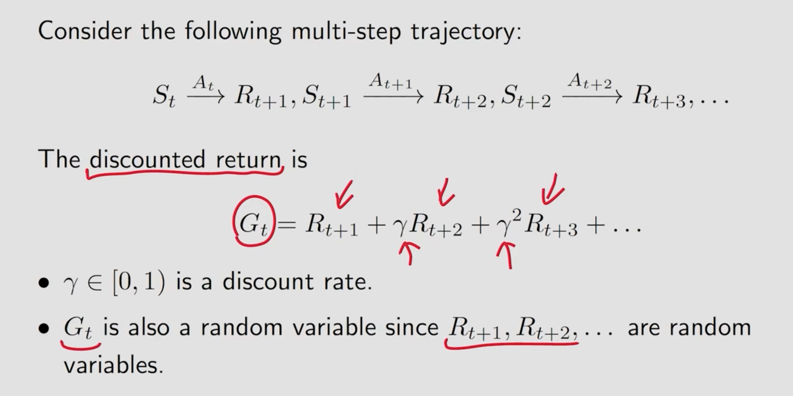
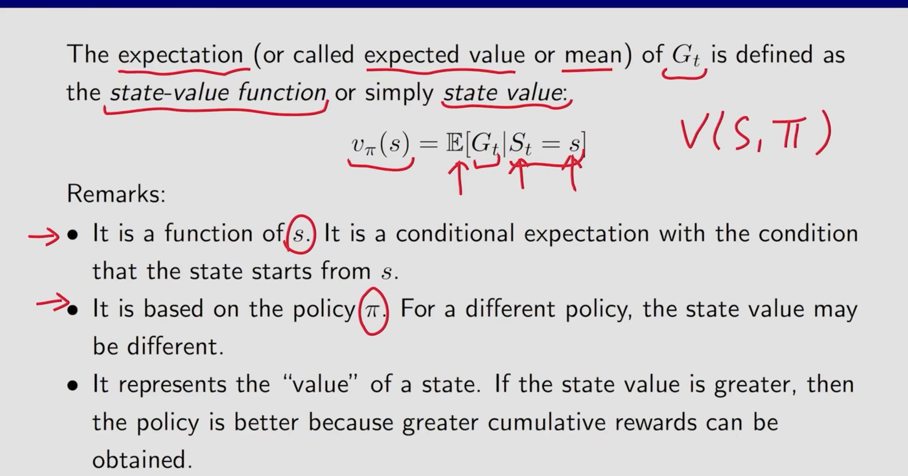
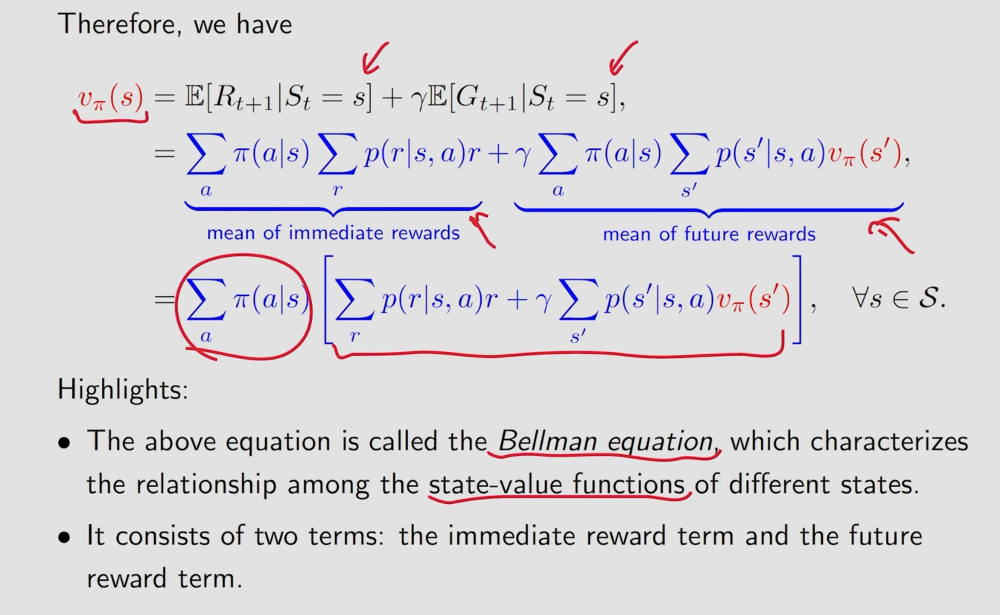

state value

State Value 为Gt的期望值，全称为 State Value Function

 

Return 和 StateValue的区别：

return为从某个状态开始沿着某一条路径获取的收益，StateValue为该状态开始沿着不同路径能收获的收益的期望。

贝尔曼公式：

贝尔曼公式的作用即是用于对一个策略的好坏进行数值化表述，其通过计算策略的均值，由上文我们能知道策略可以根据概率进行分布，同时收益也可以按概率进行分布，在某个状态有一定概率采取某个策略同时也有对应的概率获得某个收益，因此一个强化学习模型在决策的时候是如何抉择是不确定的，因此在这个公式中都通过期望的方式估计采取某个策略所获的的收益。最后他们的和既可以用于评估策略的好坏
