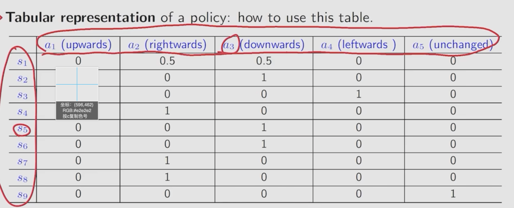
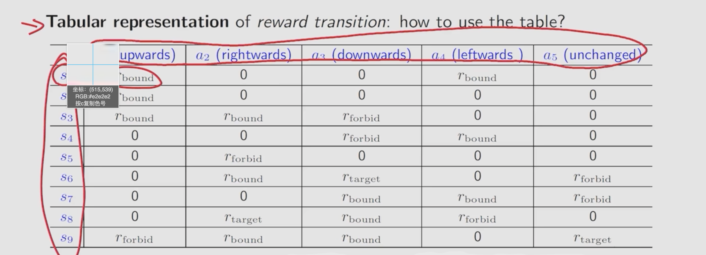
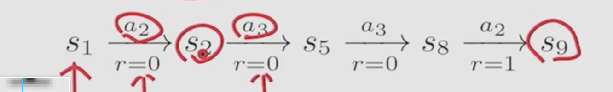
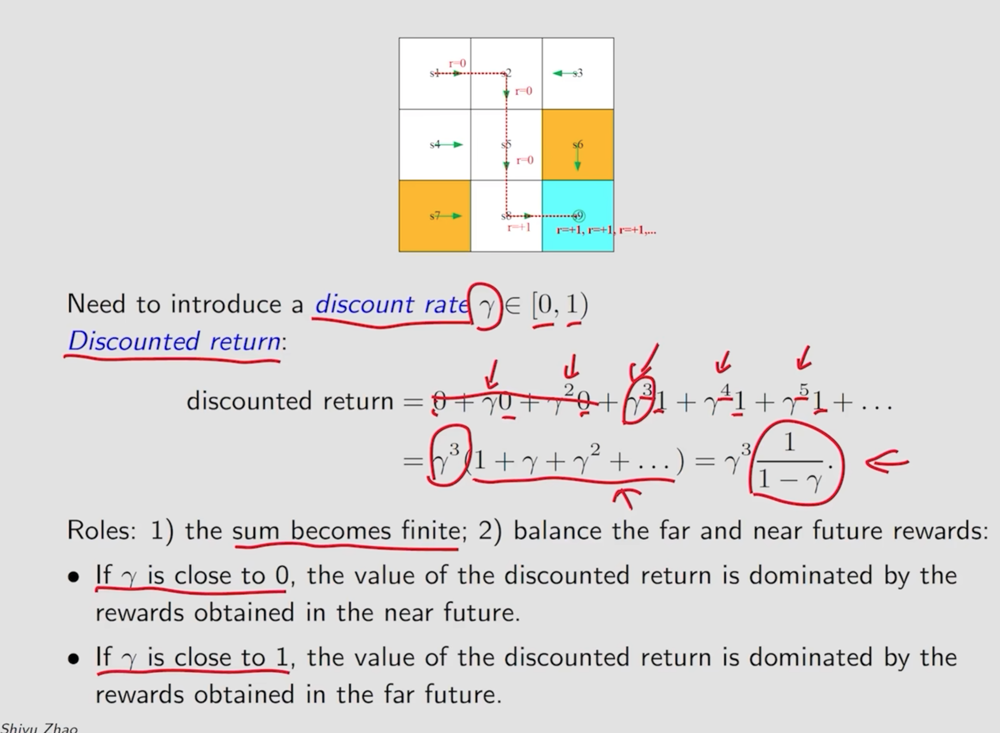
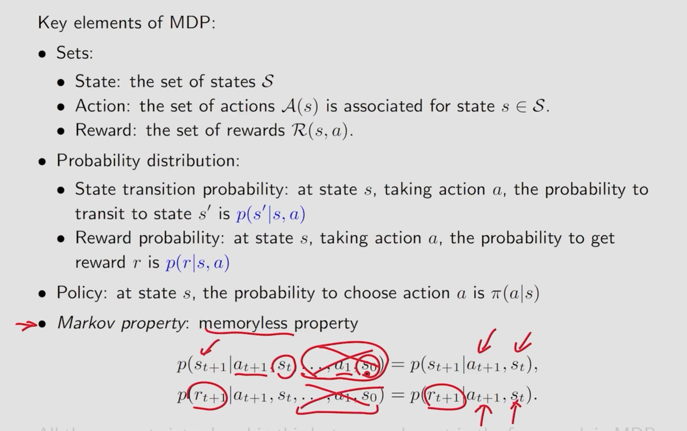

# 基本概念

State ：

State Space 状态空间： 状态的集合

Action : 动作

State Transition 某个状态经过一个动作后转换到另一个状态的过程

通常情况下，通过条件概率描述状态转移
$$
p(s_2|s1,a2)=1
$$

$$
p(s_i|s1,a2)=0 ( \forall i \neq2) 
$$

以上公式的表达的意思为，从状态S1通过动作a2转移到状态的s2的概率为1,转移到除s2以外的状态的概率为0

Policy：策略

告诉agent在某个状态下应该采取什么动作

在强化学习中，策略的表达方式也通过概率表示，记做
$$
\pi(a_1|s_1) = 0
$$

$$
\pi(a_2|s_1) = 1
$$

$$
\pi(a_3|s_1) = 0
$$
...

表示在状态s1采取动作ai的概率，它们的集合即为状态s1的策略 通过拍pi表示

策略也可以通过表格表示

Reward: 收益 在采取一个行动后获得的一个实数

正数的reward表示我们鼓励这种行为

负数的reward表示我们惩罚这种行为

reward为0 在一定程度上意味着鼓励

同样可以通过表格的格式表示reward 

局限性： 只能表示确定的reward :  即采取某个动作后一定会得到一个固定的收益。

对于不确定的收益也可以如上通过条件概率表示
$$
p(r=-1|s_1,a_1) =1  , p(r \neq -1|s_1,a_1)=0
$$
其表示在状态s1采取a1获得收益为-1的概率为1，不为-1的概率为0

Trajectory ： 状态-动作-收益的链

 return  为Trajectory所经过的轨迹所获得的收益的和  在这个例子中 return = 0+0+0+1 = 1

通过比较return能够判断哪个策略是更好的

Discounted return : 为了防止 在某个状态s 通过动作a后仍然停留在原状态且获取收益为1导致动作a不断进行最后收益发散的情况，通过收益衰减计算的收益返回值

Episode ：

Episode 为一个有限的Trajectory（会到达一个终态） 有episode 的任务为 episode tasks，若没有episode的tasks为continuing tasks/。

马尔可夫决策过程 MDP:

三大要素：

状态、动作、收益

概率分布：

状态转移概率分布、收益概率分布

策略： 在某个状态采取动作a的概率

无后效性，采取某个动作的概率和历史中执行过的动作无关。
